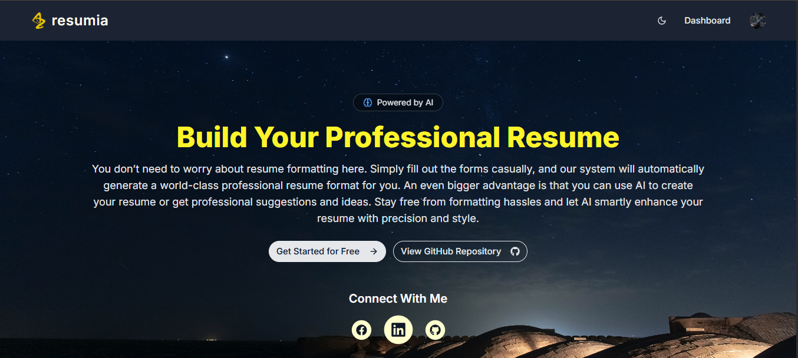

# AI-Powered Resume Builder App - FullStack (Next.js)

## 📚 Table of Contents

- [Description](#-description)
- [Live Demo](#-live-demo)
- [Features](#-features)
- [Tech Stack](#️-tech-stack)
- [Setup and Installation](#️-setup-and-installation)
- [Environment Variables](#-environment-variables)
- [Author Info](#-author-info)

## 📝 Description

I developed a full-stack AI-Powered Resume Builder Application using Next.js with its built-in server-side capabilities. This application helps users create professional resumes effortlessly, with world-class resume formats and full CRUD operation support. I integrated `Google Gemini AI` so that users can effortlessly generate professional resume descriptions using AI assistance. The system also provides intelligent skill suggestions based on the user’s resume title.

This application solves a major problem for beginners who are unsure about how a professional resume format should look. Many struggle with designing layouts or structuring their information effectively. With this app, they don’t need to worry about formatting at all — they simply fill in their information, and the system automatically generates a professional resume in a world-class format. Users can then easily download the resume as a PDF, ready to use for job applications.

## 🚀 Live Demo

[](https://full-stack-ai-resume-builder-app-ne-one.vercel.app/)

## ✨ Features

#### `Customizable Resume Sections`

- Users can add, edit, or delete any resume section.
- Support for multiple entries within a section.
- Edit or delete specific entries.

#### `AI Description Generation`

- Generate professional resume summaries.
- Generate a narrative of impactful work experiences that fit your role.
- Generate a clear and concise project description highlighting your contributions.

#### `AI Skill Suggestions`

- Provides intelligent skill suggestions based on the user’s resume title.

#### `Download as PDF`

- Users can download their resume in a PDF format.

## 🛠️ Tech Stack

- **`Frontend:`** Next.js 14, TypeScript, Tailwind CSS, Shadcn UI, Framer Motion, React Icons
- **`Backend:`** Next.js API Routes, Prisma ORM, PostgreSQL (Neon Database)
- **`AI Integration:`** Google Gemini AI
- **`Others:`** Clerk (Authentication), React Toastify

## ⚙️ Setup and Installation

### Step-by-step instructions for cloning and running locally:

```
✅ git clone https://github.com/Mohosin999/AI-Powered-Resume-Builder-App-FullStack-Next.js.git

✅ cd AI-Powered-Resume-Builder-App-FullStack-Next.js

✅ npm install

✅ npm run dev
```

## 🔑 Environment Variables

Create a `.env` file in the root directory of the project and add the following variables:

```
DATABASE_URL=

NEXT_PUBLIC_CLERK_PUBLISHABLE_KEY=

CLERK_SECRET_KEY=

GEMINI_API_KEY=
```

## 📬 Author Info

👤 **Mohosin Hasan Akash**

- 💼 **LinkedIn:** [linkedin.com/in/mohosinh99/](https://www.linkedin.com/in/mohosinh99/)
- 🌐 **Portfolio:** [personal-portfolio.com](https://personal-portfolio-website-brown-nine.vercel.app/)
- 📧 **Email:** mohosin.hasan.akash@gmail.com
